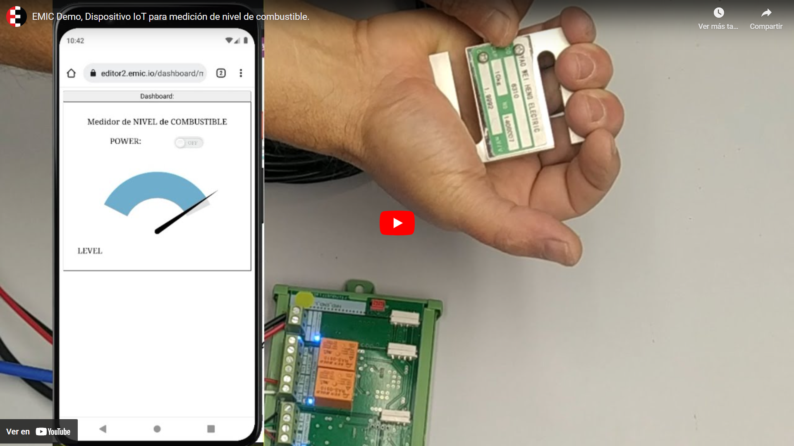
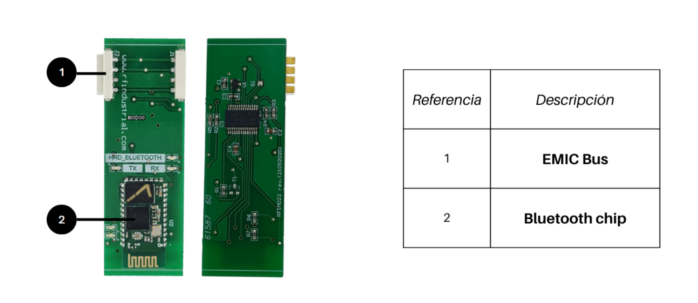
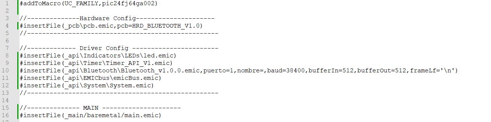
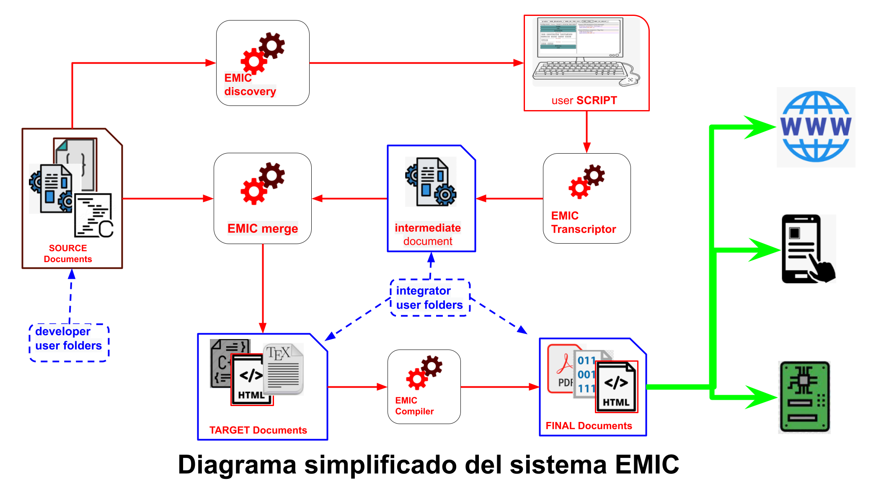

# EMIC 
- [1. Plataforma para el desarrollo colaborativo.](#1-plataforma-para-el-desarrollo-colaborativo)
  - [1.1. Introducción](#11-introducción)
  - [1.2. Breve historia:](#12-breve-historia)
  - [1.3. Estado actual de EMIC.](#13-estado-actual-de-emic)
  - [1.4. El futuro de EMIC:](#14-el-futuro-de-emic)
  - [1.5. ¿Quienes pueden pertenecer a la comunidad EMIC?](#15-quienes-pueden-pertenecer-a-la-comunidad-emic)
  - [1.6. ¿Cómo se usa EMIC?](#16-cómo-se-usa-emic)
- [2. Generación de aplicaciones y documentos.](#2-generación-de-aplicaciones-y-documentos)
- [3. Desarrollo de recursos EMIC.](#3-desarrollo-de-recursos-emic)
- [4. Modulos.](#4-modulos)
- [5. Bibliotecas.](#5-bibliotecas)
- [6. Organización de archivos y carpetas en **SOURCE Documents:**.](#6-organización-de-archivos-y-carpetas-en-source-documents)
  - [6.1. \_api.](#61-_api)
  - [6.2. \_drivers, \_hard, \_hal \_util, \_pcb, \_OS, \_main, \_interprete, \_templates.](#62-_drivers-_hard-_hal-_util-_pcb-_os-_main-_interprete-_templates)
  - [6.3. \_modulos.](#63-_modulos)
  - [6.4. Funcionamiento.](#64-funcionamiento)

## 1. Plataforma para el desarrollo colaborativo.

### 1.1. Introducción

EMIC significa Electrónica Modular Inteligente Colaborativa. Es un gestor de código que cuenta con lineamientos de estandarización que permiten conectar código de distintos desarrolladores. La plataforma integra librerías ordenadas por tipo de soporte físico (microcontroladores, web, Dockers) en repositorios de GITHUB. Un usuario puede utilizar el editor EMIC, para crear una aplicación que incluya hardware y software basado en las librerías preexistentes

Los repositorios asociados a la plataforma EMIC están compuesto por un conjunto de bibliotecas con modelos de IA, widgets basados en WebComponents, funciones y drivers.  El editor de script tipo *drag&drop* simple e intuitivo, junto con el sistema de integración de bibliotecas pueden crear código listo para compilar o ejecutar.

Además, EMIC es agnóstico respecto a la arquitectura, permite crear aplicaciones para celulares y de escritorio con tecnología PWA sitios web, servidores y servicios web basados en dockers, modelos de ML, y codigo C para todas las familias de microcontroladores y compiladores. 

### 1.2. Breve historia: 

En un principio EMIC fué creado para crear programas en lenguaje C basados en código reutilizable cuándo un grupo de programadores intercambiaba código con el fin de mejorar la productividad y calidad de sus desarrollos.

Los resultados mejoraban notablemente a medida que se normalizaba la forma de escribir las bibliotecas de código con buenas prácticas, y se comenzaron a redactar las reglas para que las funciones puedan reutilizarse de forma automática, incluso sin la necesidad de analizar a fondo el funcionamiento del código desarrollado por otros programadores.

La cantidad de código generado fue creciendo y hubo que organizarlos en carpetas. Pudiendo separar, de esta manera, las funciones que utilizan recursos de bajo nivel y las que pertenecen a distintas capas de abstracción, la [lógica de negocio ](#1 "conjunto de algoritmos que realizan el trabajo que el usuario desea ejecutar")  y la descripción del hard.  

Se creó una aplicación para automatizar la creación de programas basado en el código existente. Esto marcó un cambio fundamental, principalmente, porque cuando el programa generado de forma automática está basado en funciones que ya fueron testeadas, las posibilidades de errores y bugs eran muy reducidas. Dependiendo solamente de la lógica de negocio. Los tiempos de desarrollo se redujeron de meses a días 

Las reglas originales evolucionaron con el paso del tiempo y se agregaron etiquetado de bibliotecas, estandarización de drivers con funciones no bloqueantes y máquinas de estado, además de un conjunto de  bibliotecas genéricas. EL sistema completo se convirtió de esta manera en un [*sistema operativo multi-tarea cooperativo*](https://es.wikipedia.org/wiki/Multitarea_cooperativa "ver en wikipedia")

Se creó un entorno de desarrollo en la nube, que incluye un editor, un generador de código y compiladores, esta nueva herramienta permite generar la lógica de negocio de forma intuitiva y rápida, evitando errores de sintaxis. En esta etapa la plataforma permitió utilizar hardware y firmware existente para crear equipos electrónicos en pocos minutos.

Posteriormente se diseñó un protocolo para comunicar microcontroladores, esto permite modularizar los desarrollos, de forma que cada parte de un dispositivo electrónico puede recombinarse. Este sistema modular permite crear nuevos dispositivos en pocos minutos combinando piezas de hardware existentes.

EMIC se convirtió en una herramienta para que el desarrollador de sistemas embebidos y soluciones para la "industria 4.0" viva una experiencia única. Logrando productos robustos y confiables en tiempo record.

### 1.3. Estado actual de EMIC.

El proyecto EMIC es dinámico, semana tras semana se crean nuevas funciones, drivers y nuevo hardware, es por eso que las posibilidades de aplicaciones crecen.

Las bibliotecas utilizadas por la plataforma están alojadas repositorios, donde los colaboradores puedan experimentar en un entorno aislado y decidir cual es el mejor momento para compartir el código con la comunidad, de esta manera la plataforma EMIC se convierte en un entorno de trabajo colaborativo.

El primer repositorio creado lleva varios años de desarrollo y contine código para desarrollar firmware para sistemas embebidos basados en la familia PIC24 de microchip y cuenta con un gran número de bibliotecas con funciones y drivers entre los cuales están los de: comunicación SPI, I2C, Uart; Timers, salidas PWM, contadores, interrupciones, conversores AD, protocolos: MQTT, HTTP, JSON parser; controladores para ESP8266, sensores DHT22, DHT11, ADS1231, motores PXP, seven segment, funciones para displays gráficos, manejo de stream y punteros para el intercambio de datos entre funciones, manejo de cadenas de caracteres, y muchos más.

El segundo repositorio está destinado a la creación de widgets para desarrollo font-end de sitios web, está en proceso de restructuración para mejorar la calidad de código, cuenta con varios widgets listos para usar, como paneles contenedores, textBox, labels, buttons, gráficos históricos, gauges, sliders y tablas. 

Otros repositorios en estado experimental son: modelos de redes neuronales, código para otras familias de microcontroladores, y dockers para servicios webs.

Respecto al hardware, EMIC cuenta con 50 módulos de hardware desarrollados por distintos miembros de la comunidad. Entre los que se encuentran los módulos de conectividad (WiFi, Bluetooth, LoRa WAN, radios con modulación FSK y LoRa, RS485, RS232); Módulos de display (siete segmentos y gráficos); sensores (temperatura, humedad, corriente, tensión, celdas de cargas, gases, etc); actuadores (relés, motores paso a paso, triacs, salidas PWM, etc ); entradas y salidas digitales y analógicas; entre otros.

También estamos trabajando en el desarrollo de una aplicación que simplifique la creacion de nuevo hardware, que permitiría en pocos minutos y mediante un editor drag&drop, obtener los archivo con la configuración del conexionado de pines y los otros recursos del microcontrolador (SPI, I2C, DMA, UART, etc.)

### 1.4. El futuro de EMIC:

El sistema sigue evolucionando, estamos incorporando nuevas funciones, experimentando con procesamiento de datos con inteligencia artificial, y despliegue de dockers para servicios web. Además estamos desarrollando un asistente para el desarrollo de hardware.

Para acelerar el crecimiento convocamos a todos los interesados a participar de esta gran experiencia de desarrollo colaborativo. La invitación va dirigida tanto a personas que tienen un camino recorrido en el mundo de los embebidos, desarrollo web y modelos de IA, como a quienes están dando sus primeros pasos, las contribuciones esperadas pueden ser: simples comentarios, validación de código, aporte de ideas, desarrollo de funciones y drivers, diseño de hardware, desarrollo de dockers para servidores backend, modelos de IA, etc.

Si bien, el aporte de más desarrolladores y usuarios que validen cada pieza de la plataforma es importante para la comunidad. No es necesario compartir todo el código creado, cada usuario puede trabajar en forma privada y luego decidir que quiere compartir con el resto. 

### 1.5. ¿Quienes pueden pertenecer a la comunidad EMIC?

No hay restricciones para pertenecer a la comunidad, el requisito mas importante el ser un apasionado por la electrónica, los sistemas embebidos, el desarrollo web, la IA o las otras tecnologías que impulsan la cuarta revolución industrial o "industria 4.0", también se valora el espíritu colaborativo.

Cada miembro puede disponer libremente del resultado logrado por el uso de la plataforma, pero es importante mantener informado a la comunidad sobre los resultados técnicos utilizando los canales oficiales.

No es obligatorio compartir todos los desarrollos con la comunidad, cada uno decide libremente qué y cuando compartir, pero es deseable que los miembros hagan aportes de forma regular.

Tipos de aportes que se esperan:

- Desarrollo circuitos de hardware (esquemáticos y PCB)
- Desarrollo de software (funciones, drivers, widgets basados en webComponents, APIS en dockers, modelos de IA, etc)
- Testeo y validación en campo.
- Publicaciones en redes y difusión.
- Propuestas de ideas para desarrollos colaborativos.
- Otros aportes valorados por la comunidad.

Solo los miembros de la comunidad pueden acceder a la plataforma con todos sus beneficios. Para solicitar la membresía se debe llenar el siguiente formulario https://forms.gle/DfKtNX7yH6ZFYf938

### 1.6. ¿Cómo se usa EMIC? 

Hay dos maneras de utilizar la plataforma EMIC:

1) **Modo Integración de soluciones 4.0:** 
   Pensado para aquellas personas que necesiten desarrollar una aplicación basada en hardware, firmware, modelos de IA, contenedores dockers o widgwets web existentes con el objetivo de resolver un problema específico.
   Todos los miembros de la comunidad pueden usar la plataforma en este modo ingresando en [*editor.emic.io*](https://editor.emic.io), allí encontrará los recursos que fueron desarrollados por él y otros miembros.
   Si necesita utilizar algún módulo de hardware desarrollado por otro miembro, puede solicitarlo en forma directa o por medio de los canales oficiales. En ese caso, el precio del módulo es pactado entre el desarrollador y el integrador. También se puede utilizar el hardware que algunos desarrolladores deciden ceder a la comunidad y por lo tanto su valor es muy conveniente.
   
   Más informacion en [2. Generación de Aplicaciones y documentos.](#2-generación-de-aplicaciones-y-documentos)
   
1) **Modo Desarrollo:**
   Quienes tienen conocimientos en algunas de las tecnologías usadas en EMIC, pueden pedir acceso a los repositorios para colaborar en el desarrollo de software.
   Desde la plataforma podrán sincronizar los cada repositorio y acceder a los nuevos recursos desarrollados por la comunidad.
   
   Mas información en 

## 2. Generación de aplicaciones y documentos.

El modo integración esta diseñado para que la integración de todas las partes (llamadas módulos) que conforman un proyecto se realicen de una forma simple, rápido y con muy baja probabilidad de falla. 

Los módulos son las piezas fundamentales de un proyecto EMIC y pueden ser sitios web, servicio en la nube, modelos de ML o módulos de hardware.

La integración se realiza por medio de un editor visual, arrastrando las etiquetas o íconos que representan cada una de los módulos y soltando sobre el area del proyecto. De la misma manera se van agregando otros recursos como páginas web, widgets, funciones, variables, eventos, etc.

---------------------------------------------------

> Falta completar este punto.

## 3. Desarrollo de recursos EMIC.

LLamamos recursos EMIC a una porción de texto o código que se crea dentro de un repositorio EMIC para ser utilizado en un proyecto.

Para que el recurso se utilizable en un proyecto, debe estar referenciado por otro recurso o debe ser descrito mediante una "etiqueta" que el sistema EMIC reconoce para que pueda indexarlo y presentarlo en el editor.  

Existen varias clases de recursos y en cada repositorio podremos encontrar alguna de esas clases según su función dentro de la plataforma,
por ejemplo en el repositorio dashboard podemos encontrar *widgets*  basados en WebComponents y funciones de javascript.

El sistema EMIC, reconoce tres tipos de recursos que tienen un tratamiento especial: las funciones, las variables
y los eventos.

Además se pueden crear nuevos tipos de recursos que se autodefinen mediante un bloque de texto en formato json, donde se describen todos los atributos necesarios para su comportamiento, como el nombre que va a mostrar en el editor, como se va instanciar en el script o en area de trabajo y como se va comportar cuando el proyecto se compile teniendo una o varias instancias.

Cada carpeta tiene un 
para comenzar a editar una solución hay que entrar en la carpeta "My Projects"

El sistema usará el documento creado en el proceso de edición del *script* y los transforma en código para un lenguaje de programación específico, como por ejemplo C, LaTex, Javascript  o HTML (Tutorial de edición de *script*).

El código generado junto con las bibliotecas alojadas en los repositorios utilizados en el proyecto, crea los documentos listos para compilar (en caso de c o latex), o para publicar (en caso de python, JS, HTML, etc.).

Cuando el integrador comienza a editar el *script*, primero debe elegir que módulos integrarán la solución a diseñar, es por ello, que se le presentará una lista con todos los módulos disponibles, que pueden ser módulos de hardware, aplicaciones que corren en la nube, dashboard, modelos de Inteligencia artificial, etc. La lista de módulos esta en crecimiento y son el aporte de los desarrolladores expertos.

Una vez que fueron seleccionados los módulos, comienza la edicion del *Script* de cada uno, para ello cuenta con un conjunto de recursos disponibles específico para tipo de módulo que se está editando. Estos recursos son llamados bibliotecas o drivers, y forman parte de la difinición de cada módulo, tambien son aportados por los desarrolladores expertos, podemos decir que un módulo está definido por un conjuntos de driver. Cabe aclarar un driver puede estar incluido en mas de un módulo.

EL proceso de creación de drivers, bibliotecas y módulos que realiza un desarrollador experto es similar a la creación de aplicaciónes o documento de forma tradicional, donde se usa cualquier editor de texto. El desarrallodor crea los fragmentos de código que luego formará parte de la solución integrada, dentro de ese conjunto de bibliotecas estan las llamadas apis, que son las bibliotecas que se utilzan como conexión entre el *Script* y el código aportado por los desarrolladores.

La única deferencia entre una api y las otras bibliotecas es que algunos fragmentos de código de las apis tienen asociado metatexto, es decir una descripción para que un proceso del sistema EMIC, llamado Discovery reconozca el metatexto para presentar la entrada a la librería como un recurso disponible para ser usado en el *Script* por el integrador.

## 4. Modulos.

Los módulos EMIC son el elemento central del sistema, es para el desarrollador el objetivo final y para el integrador el comienzo. En decir que es la interface entre los dos mundos.
Existen distintos tipos de módulos, los que representan a un hardware específico y sus capacidades o funciones, los que definen a una interface visual en la nube, los que definen una aplicación para teléfonos móviles o tablets y PC, y los que definen un proceso alojado en un servidor como bases de datos; procesos backends; e instancias modelos de inteligencia artificial.
A si vez los módulos EMIC, estan compuestos por drivers, que son un grupo de funciones y características, podriamos decir que los módulos estan definidos por un conjunto de drivers, ademas de tener otros elementos que los describen.
A continuacion de muestra un ejemplo de la definición de un módulos de harware con funciones de comunicación Bluetooth:

  

    
  

  

    
  

En el documento que define el módulo se pueden observar las lineas con comandos EMIC CODIFY que son interpretados por un sub-sistema EMIC llamado EMIC transcriptor.
   
  Linea 1.  **#addToMacro(UC_FAMILY,pic24fj64ga002)** crea una macro llamada UC_FAMILY y le asigna el valor pic24fj64ga002.
   
  Linea  4.  **#insertFile(_pcb\pcb.emic,pcb=HRD_BLUETOOTH_V1.0)** inserta el archivo *"pcb.emic"* ubicado en la carpeta *"_pcb"* y le pasa un parametro llamado *"pcb"* con el valor *"HRD_BLUETOOTH_V1"*, en ese archivo está la definición de la placa con la asignación de los pines del microprocesador y la configuración del hardware.

  Linea 8. **#insertFile(_api\Indicators\LEDs\led.emic)** inserta el archivo con las funciones relacinadas a los Leds

  Linea 9. **#insertFile(_api\Timer\Timer_API_V1.emic)**  inserta el archivo con las funciones relacinadas a los Temporizadores

  Linea 10. **#insertFile(_api\Bluetooth\Bluetooth_v1.0.0.emic,puerto=1,nombre=,baud=38400,bufferIn=512,bufferOut=512,frameLf='\n')**  inserta el archivo con las funciones relacinadas al manejo de la comunicación Bluetooth, pansandole los parametros de configuración.

  Linea 11. **#insertFile(_api\EMICbus\emicBus.emic)** inserta el archivo con las funciones relacinadas a los Bus EMIC, que permite la comunicación con otros módulos de hardware vecinos.

  Linea 12. **#insertFile(_api\System\System.emic)** inserta el archivo con las funciones relacinadas al sistema.

  Linea 16. **#insertFile(_main/baremetal/main.emic)**  inserta el archivo con las funcion main, necesaria para el 

Como se ve en el ejemplo la definición de los módulos consiste en un simple documento de texto plano compuesto por comandos pertencientes al lenguaje EMIC CODIFY que se ejecutan de forma secuencial al momento que el integrador selecciona el módulo para incluirlo en la solución.

## 5. Bibliotecas.

LLamamos biblitotecas a todos los archivos que el sistema EMIC incluye en la generacion de un resultado por medio del comando  **#insertFile(dir/file.emic)**, es decir una biblitoca es procesada por el sistema EMIC, cuando es referencida por un módulo o por otra biblioteca.
 Las biblitecas tambien estan formadas por comandos [EMIC CODIFY](EMICCodify.md), aunque normalmente tienen además, fragmentos de téxto que no es interpretado por el sistema y simplemente es transcripto desde la biblioteca al documento generado como salida del sistema.

## 6. Organización de archivos y carpetas en **SOURCE Documents:**.

EMIC  
  ├──  📁[_api](#_api)  
  ├──  📁[_drivers](_drivers)  
  ├──  📁[_hard](_hard)  
  ├──  📁[_hal](_hal)  
  ├──  📁[_interprete](_interprete)  
  ├──  📁[_modulos](_modulos)  
  ├──  📁[_OS](_OS)   
  ├──  📁[_pcb](_placas)   
  ├──  📁[_templates](_templates)   
  ├──  📁[_util](_util)   
  

### 6.1. _api.

En la carpeta [_api](_api) están contenidos las funciones que tienen conexión con la lógica de negocio, es decir, puede tener funciones o variables que pueden ser accedidas desde el *script*.

Los recursos almacenados (funciones y variables, en el caso de la creación de código) en _api, se describen en archivos de texto destinados a tal fin. 

### 6.2. _drivers, _hard, _hal _util, _pcb, _OS, _main, _interprete, _templates.

En estas carpetas hay código que si bien cumplen distintas funciones (en correspondencia con su nombre) no recibe ningún tratamiento especial por parte del sistema. Para que un archivo almacenado en esta carpeta forme parte de una aplicación, deberá ser invocada por un recurso de nivel superior.

### 6.3. _modulos.

En esta carpeta se almacena la descripción de los recursos de mayor nivel llamdos módulos. Que a su vez están compuestos por otros recursos definidos en la carpeta _api

### 6.4. Funcionamiento.

Como plataforma colaborativa, el propósito principal de EMIC es generar distintos tipos de documentos, como programas ejecutables por los módulos electrónicos, aplicaciones de teléfonos inteligentes o tablets y páginas webs.

Los ingredientes necesarios para generar estas aplicaciones y documentos se dividen en dos clases:

  1. El material creado por los usuarios expertos en distintas áreas del conocimiento. Dentro de esta categoría están incluidos archivos en distintos formato estándar. Por ejemplo:

      * Código C (*.c)
      * Header (*.h)
      * Web (*.html, *.css, *.js)
      * Latex (*.tex)
      * Markdown (*.md)

  Estos archivos van acompañados de metatexto y comandos que el sistema interpreta para saber como tratarlos.

  2. El *script* creado por cualquier usuario (incluyendo a los expertos). La herramienta utilizada para esta tarea es el [editor EMIC](https://editor.emic.io) edición del tipo *drag&drop*  dentro de un entorno intuitivo. Donde además de código se pueden editar páginas web de manera y pantallas gráficas de manera visual.
  
En otras palabras, en una aplicación EMIC se fusionan el conocimiento y la experiencia de desarrolladores e integradores y generan un resultado de alta calidad.

Vemos en el diagrama de funcionamiento, los distintos pasos para crear una aplicación web o un dispositivo electrónico.
El sistema esta formado por cuatro procesos que transforman distintos  documentos de entrada en otros de salidas (EMIC Discovery, EMIC Transcriptor, EMIC Marge, EMIC Compiler), tres almacenes de documentos (SOURCE Documents, Intermediate Documents, y FINAL Documents) y un editor de Script.

**EMIC Discovery:** este proceso es el encargado transformar los documentos alojado en *Source Documents* en información utilizada por el editor, es decir que genera una lista de recursos que luego pueden ser utilizados por quien edita el escript.

**EMIC Transcriptor:** este proceso parte del script editado por el usuario y genera un documento que contiene la misma información pero en un formato diferente.

**EMIC Merge:** partiendo del los documentos originales y del script transcripto, este proceso genera documentos que pertenecen a distinto formatos estándares como código C, latex, HTML, javascript, etc.

**EMIC Compiler:** en caso que los documentos generados por EMIC marge necesiten ser compilados, este proceso se encarga de ejecutar al compilador que corresponde dependiendo del tipo de documento generado.

**Intermediate Documents:** almacén donde residen los documentos generados por el transcriptor.

**TARGET Documents:** acá se almacena el primer resultado útil,

**SOURCE Documents:** es donde se almacenan los documentos creados por los desarrolladores del código fuente, este código va acompañado por información adicional, que describe el comportamiento dentro del sistema. Esta único lugar donde los usuarios ingresan documentos en forma directa y donde los desarrolladores compartimos código con el resto. Dada la importancia de esta carpeta se dedicará una sección para explicarla en detalle su estructura.

[#1]: conjunto de algoritmos que realizan el trabajo que el usuario desea ejecutar
