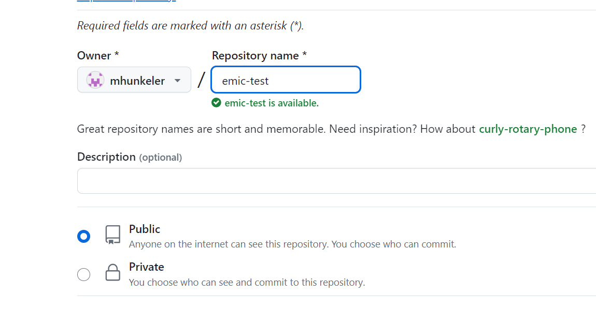

# EMIC 
- [1. Plataforma para el desarrollo colaborativo.](#1-plataforma-para-el-desarrollo-colaborativo)
  - [1.1. Introducción](#11-introducción)
  - [1.2. Breve historia:](#12-breve-historia)
  - [1.3. Estado actual de EMIC.](#13-estado-actual-de-emic)
  - [1.4. El futuro de EMIC:](#14-el-futuro-de-emic)
  - [1.5. ¿Quienes pueden pertenecer a la comunidad EMIC?](#15-quienes-pueden-pertenecer-a-la-comunidad-emic)
  - [1.6. ¿Cómo se usa EMIC?](#16-cómo-se-usa-emic)
- [2. Creación de proyectos integrados.](#2-creación-de-proyectos-integrados)
- [3. Desarrollo de recursos para la plataforma EMIC.](#3-desarrollo-de-recursos-para-la-plataforma-emic)
  - [3.1. Trabajar con repositorios EMIC.](#31-trabajar-con-repositorios-emic)
    - [3.1.1. Crear un repositorio en GitHub.](#311-crear-un-repositorio-en-github)
    - [3.1.2. Estructura básica de un repositorio EMIC.](#312-estructura-básica-de-un-repositorio-emic)
    - [3.1.3. Creación de un módulo](#313-creación-de-un-módulo)
- [4. Funcionamiento del sistema.](#4-funcionamiento-del-sistema)
- [5. EMIC CODIFY.](#5-emic-codify)
  - [5.1. Introducción.](#51-introducción)
  - [5.2. EMIC Codify.](#52-emic-codify)
  - [5.3. Comandos EMIC Codify:](#53-comandos-emic-codify)
  - [5.4. setImput](#54-setimput)
    - [5.4.1. Sintaxis:](#541-sintaxis)
      - [5.4.1.1. Definiciones:](#5411-definiciones)
  - [5.5. setOutput](#55-setoutput)
    - [5.5.1. Sintaxis:](#551-sintaxis)
      - [5.5.1.1. Definiciones:](#5511-definiciones)
  - [5.6. restoreOutput](#56-restoreoutput)
    - [5.6.1. Sintaxis:](#561-sintaxis)
    - [5.6.2. copy](#562-copy)
    - [5.6.3. Sintaxis:](#563-sintaxis)
    - [5.6.4. Definiciones:](#564-definiciones)
  - [5.7. define](#57-define)
    - [5.7.1. Sintaxis:](#571-sintaxis)
    - [5.7.2. Definiciones:](#572-definiciones)
  - [5.8. unDefine](#58-undefine)
    - [5.8.1. Sintaxis:](#581-sintaxis)
    - [5.8.2. Definiciones:](#582-definiciones)
  - [5.9. .{group.key}.](#59-groupkey)
  - [5.10. EMIC:foreach(**group**)    .{Item}.     EMIC:endfor](#510-emicforeachgroup----item-----emicendfor)
    - [5.10.1. Sintaxis:](#5101-sintaxis)
  - [5.11. if](#511-if)
    - [5.11.1. Definiciones:](#5111-definiciones)
    - [5.11.2. Sintaxis:](#5112-sintaxis)
    - [5.11.3. Definiciones:](#5113-definiciones)
    - [5.11.4. Sintaxis:](#5114-sintaxis)
    - [5.11.5. Definiciones:](#5115-definiciones)
    - [5.11.6. Sintaxis:](#5116-sintaxis)
    - [5.11.7. Definiciones:](#5117-definiciones)
    - [5.11.8. Sintaxis:](#5118-sintaxis)
    - [5.11.9. Definiciones:](#5119-definiciones)
    - [5.11.10. Sintaxis:](#51110-sintaxis)
    - [5.11.11. Definiciones:](#51111-definiciones)

<div style="page-break-after: always;"></div>

## 1. Plataforma para el desarrollo colaborativo.

### 1.1. Introducción

EMIC significa Electrónica Modular Inteligente Colaborativa. Es un gestor de código que cuenta con lineamientos de estandarización que permiten conectar código de distintos desarrolladores. La plataforma integra librerías ordenadas por tipo de soporte físico (microcontroladores, web, Dockers) en repositorios de GITHUB. Un usuario puede utilizar el editor EMIC, para crear una aplicación que incluya hardware y software basado en las librerías preexistentes

Los repositorios asociados a la plataforma EMIC están compuesto por un conjunto de bibliotecas con modelos de IA, widgets basados en WebComponents, funciones y drivers.  El editor de script tipo *drag&drop* simple e intuitivo, junto con el sistema de integración de bibliotecas pueden crear código listo para compilar o ejecutar.

Además, EMIC es agnóstico respecto a la arquitectura, permite crear aplicaciones para celulares y de escritorio con tecnología PWA sitios web, servidores y servicios web basados en dockers, modelos de ML, y código C para todas las familias de microcontroladores y compiladores. 

### 1.2. Breve historia: 

En un principio EMIC fué creado para crear programas en lenguaje C basados en código reutilizable cuándo un grupo de programadores intercambiaba código con el fin de mejorar la productividad y calidad de sus desarrollos.

Los resultados mejoraban notablemente a medida que se normalizaba la forma de escribir las bibliotecas de código con buenas prácticas, y se comenzaron a redactar las reglas para que las funciones puedan reutilizarse de forma automática, incluso sin la necesidad de analizar a fondo el funcionamiento del código desarrollado por otros programadores.

La cantidad de código generado fue creciendo y hubo que organizarlos en carpetas. Pudiendo separar, de esta manera, las funciones que utilizan recursos de bajo nivel y las que pertenecen a distintas capas de abstracción, la [lógica de negocio ](#1 "conjunto de algoritmos que realizan el trabajo que el usuario desea ejecutar")  y la descripción del hard.  

Se creó una aplicación para automatizar la creación de programas basado en el código existente. Esto marcó un cambio fundamental, principalmente, porque cuando el programa generado de forma automática está basado en funciones que ya fueron testeadas, las posibilidades de errores y bugs eran muy reducidas. Dependiendo solamente de la lógica de negocio. Los tiempos de desarrollo se redujeron de meses a días 

Las reglas originales evolucionaron con el paso del tiempo y se agregaron etiquetado de bibliotecas, estandarización de drivers con funciones no bloqueantes y máquinas de estado, además de un conjunto de  bibliotecas genéricas. EL sistema completo se convirtió de esta manera en un [*sistema operativo multi-tarea cooperativo*](https://es.wikipedia.org/wiki/Multitarea_cooperativa "ver en wikipedia")

Se creó un entorno de desarrollo en la nube, que incluye un editor, un generador de código y compiladores, esta nueva herramienta permite generar la lógica de negocio de forma intuitiva y rápida, evitando errores de sintaxis. En esta etapa la plataforma permitió utilizar hardware y firmware existente para crear equipos electrónicos en pocos minutos.

Posteriormente se diseñó un protocolo para comunicar microcontroladores, esto permite modularizar los desarrollos, de forma que cada parte de un dispositivo electrónico puede recombinarse. Este sistema modular permite crear nuevos dispositivos en pocos minutos combinando piezas de hardware existentes.

EMIC se convirtió en una herramienta para que el desarrollador de sistemas embebidos y soluciones para la "industria 4.0" viva una experiencia única. Logrando productos robustos y confiables en tiempo record.

### 1.3. Estado actual de EMIC.

El proyecto EMIC es dinámico, semana tras semana se crean nuevas funciones, drivers y nuevo hardware, es por eso que las posibilidades de aplicaciones crecen.

Las bibliotecas utilizadas por la plataforma están alojadas repositorios, donde los colaboradores puedan experimentar en un entorno aislado y decidir cual es el mejor momento para compartir el código con la comunidad, de esta manera la plataforma EMIC se convierte en un entorno de trabajo colaborativo.

El primer repositorio creado lleva varios años de desarrollo y contiene código para desarrollar firmware para sistemas embebidos basados en la familia PIC24 de microchip y cuenta con un gran número de bibliotecas con funciones y drivers entre los cuales están los de: comunicación SPI, I2C, UART; Timers, salidas PWM, contadores, interrupciones, conversores AD, protocolos: MQTT, HTTP, JSON parser; controladores para ESP8266, sensores DHT22, DHT11, ADS1231, motores PXP, seven segment, funciones para displays gráficos, manejo de stream y punteros para el intercambio de datos entre funciones, manejo de cadenas de caracteres, y muchos más.

El segundo repositorio está destinado a la creación de widgets para desarrollo font-end de sitios web, está en proceso de restructuración para mejorar la calidad de código, cuenta con varios widgets listos para usar, como paneles contenedores, textBox, labels, buttons, gráficos históricos, gauges, sliders y tablas. 

Otros repositorios en estado experimental son: modelos de redes neuronales, código para otras familias de microcontroladores, y dockers para servicios webs.

Respecto al hardware, EMIC cuenta con 50 módulos de hardware desarrollados por distintos miembros de la comunidad. Entre los que se encuentran los módulos de conectividad (WiFi, Bluetooth, LoRa WAN, radios con modulación FSK y LoRa, RS485, RS232); Módulos de display (siete segmentos y gráficos); sensores (temperatura, humedad, corriente, tensión, celdas de cargas, gases, etc); actuadores (relés, motores paso a paso, triacs, salidas PWM, etc ); entradas y salidas digitales y analógicas; entre otros.

También estamos trabajando en el desarrollo de una aplicación que simplifique la creación de nuevo hardware, que permitiría en pocos minutos y mediante un editor drag&drop, obtener los archivo con la configuración del conexionado de pines y los otros recursos del microcontrolador (SPI, I2C, DMA, UART, etc.)

### 1.4. El futuro de EMIC:

El sistema sigue evolucionando, estamos incorporando nuevas funciones, experimentando con procesamiento de datos con inteligencia artificial, y despliegue de dockers para servicios web. Además estamos desarrollando un asistente para el desarrollo de hardware.

Para acelerar el crecimiento convocamos a todos los interesados a participar de esta gran experiencia de desarrollo colaborativo. La invitación va dirigida tanto a personas que tienen un camino recorrido en el mundo de los embebidos, desarrollo web y modelos de IA, como a quienes están dando sus primeros pasos, las contribuciones esperadas pueden ser: simples comentarios, validación de código, aporte de ideas, desarrollo de funciones y drivers, diseño de hardware, desarrollo de dockers para servidores backend, modelos de IA, etc.

Si bien, el aporte de más desarrolladores y usuarios que validen cada pieza de la plataforma es importante para la comunidad. No es necesario compartir todo el código creado, cada usuario puede trabajar en forma privada y luego decidir que quiere compartir con el resto. 

### 1.5. ¿Quienes pueden pertenecer a la comunidad EMIC?

No hay restricciones para pertenecer a la comunidad, el requisito mas importante el ser un apasionado por la electrónica, los sistemas embebidos, el desarrollo web, la IA o las otras tecnologías que impulsan la cuarta revolución industrial o "industria 4.0", también se valora el espíritu colaborativo.

Cada miembro puede disponer libremente del resultado logrado por el uso de la plataforma, pero es importante mantener informado a la comunidad sobre los resultados técnicos utilizando los canales oficiales.

No es obligatorio compartir todos los desarrollos con la comunidad, cada uno decide libremente qué y cuando compartir, pero es deseable que los miembros hagan aportes de forma regular.

Tipos de aportes que se esperan:

- Desarrollo circuitos de hardware (esquemáticos y PCB)
- Desarrollo de software (funciones, drivers, widgets basados en webComponents, APIS en dockers, modelos de IA, etc)
- Testeo y validación en campo.
- Publicaciones en redes y difusión.
- Propuestas de ideas para desarrollos colaborativos.
- Otros aportes valorados por la comunidad.

Solo los miembros de la comunidad pueden acceder a la plataforma con todos sus beneficios. Para solicitar la membresía se debe llenar el siguiente formulario https://forms.gle/DfKtNX7yH6ZFYf938

### 1.6. ¿Cómo se usa EMIC? 

Hay dos maneras de utilizar la plataforma EMIC:

1) **Modo Integración de soluciones 4.0:** 
   Pensado para aquellas personas que necesiten desarrollar una aplicación basada en hardware, firmware, modelos de IA, contenedores dockers o widgets web existentes con el objetivo de resolver un problema específico.
   Todos los miembros de la comunidad pueden usar la plataforma en este modo ingresando en [*editor.emic.io*](https://editor.emic.io), allí encontrará los recursos que fueron desarrollados por él y otros miembros.
   Si necesita utilizar algún módulo de hardware desarrollado por otro miembro, puede solicitarlo en forma directa o por medio de los canales oficiales. En ese caso, el precio del módulo es pactado entre el desarrollador y el integrador. También se puede utilizar el hardware que algunos desarrolladores deciden ceder a la comunidad y por lo tanto su valor es muy conveniente.
   
   Más información en [2. Generación de Aplicaciones y documentos.](#2-generación-de-aplicaciones-y-documentos)
   
1) **Modo Desarrollo:**
   Quienes tienen conocimientos en algunas de las tecnologías usadas en EMIC, pueden pedir acceso a los repositorios para colaborar en el desarrollo de software.
   Desde la plataforma podrán sincronizar los cada repositorio y acceder a los nuevos recursos desarrollados por la comunidad.
   
   Mas información en []()

<div style="page-break-after: always;"></div>

## 2. Creación de proyectos integrados.

El modo integración esta diseñado para que la integración de todas las partes (llamadas módulos) que conforman un proyecto se realicen de una forma simple, rápido y con muy baja probabilidad de falla. 

Los módulos son las piezas fundamentales de un proyecto EMIC y pueden ser sitios web, servicio en la nube, modelos de ML o módulos de hardware.

La integración se realiza por medio de un editor visual, arrastrando las etiquetas o íconos que representan a los módulos y luego soltarlos sobre el area del proyecto. Posteriormente, se la misma manera se irán agregando otros recursos como páginas web, widgets, funciones, variables, eventos, etc. para configurar el comportamiento del módulo en el proyecto.


En el video podemos observar el desarrollo de una proyecto en el que se integra dos módulos de hardware y un aplicación web.

<a href="https://www.youtube.com/embed/o6HerU3PRl8">
  
</a>

---------------------------------------------------

El sistema usará el documento creado en el proceso de edición del *script* y los transforma en código para un lenguaje de programación específico, como por ejemplo C, LaTex, Javascript o HTML (Tutorial de edición de *script*).

El código generado junto con las bibliotecas alojadas en los repositorios utilizados en el proyecto, formarán parte de los documentos resultantes, y estarán listos para compilar (en caso de c o latex), o para publicar (en caso de python, JS, HTML, etc.).

Cuando el integrador comienza a editar el *script*, primero debe elegir que módulos integrarán la solución a diseñar, es por ello, que se le presentará una lista con todos los módulos disponibles, que pueden ser módulos de hardware, aplicaciones que corren en la nube, dashboard, modelos de Inteligencia artificial, etc. La lista de módulos esta en crecimiento y son el aporte de la comunidad de desarrolladores expertos.

Una vez que fueron seleccionados los módulos, comienza la edición del *Script* de cada uno, para ello cuenta con un conjunto de recursos disponibles específico para tipo de módulo que se está editando. Estos recursos podrían ser bibliotecas o drivers, y forman parte de la definición de cada módulo, también son aportados por los desarrolladores expertos, podemos decir que un módulo está definido por un conjuntos de driver. Cabe aclarar un driver puede estar incluido en mas de un módulo.

<div style="page-break-after: always;"></div>

## 3. Desarrollo de recursos para la plataforma EMIC.

EL proceso de creación de drivers, bibliotecas y módulos que realiza un desarrollador experto es similar a la creación de aplicaciónes o documento de forma tradicional, donde se usa cualquier editor de texto. El desarrallodor crea los fragmentos de código que luego formará parte de la solución integrada, dentro de ese conjunto de bibliotecas estan las llamadas apis, que son las bibliotecas que se utilzan como conexión entre el *Script* y el código aportado por los desarrolladores.

La única deferencia entre una api y las otras bibliotecas es que algunos fragmentos de código de las apis tienen asociado metatexto, es decir una descripción para que un proceso del sistema EMIC, llamado Discovery reconozca el metatexto para presentar la entrada a la librería como un recurso disponible para ser usado en el *Script* por el integrador.

Los recursos EMIC pueden ser porciones de texto o código que se crean dentro de un repositorio EMIC para ser utilizado en un proyecto.

Para que el recurso se utilizable en un proyecto, debe estar referenciado por otro recurso o debe ser descrito mediante una "etiqueta" que el sistema EMIC reconoce y lo indexa para presentarlo en el editor.  

Existen varias clases de recursos y en cada repositorio podremos encontrar alguna de esas clases según su función dentro de la plataforma,
por ejemplo en el repositorio dashboard podemos encontrar *widgets*  basados en WebComponents y funciones de javascript.

El sistema EMIC, reconoce tres tipos de recursos que tienen un tratamiento especial:los módulos, las funciones, las variables y los eventos.

Además se pueden crear nuevos tipos de recursos que se autodefinen mediante un bloque de texto en formato json, donde se describen todos los atributos necesarios para su comportamiento, como el nombre que va a mostrar en el editor, como se va instanciar en el script o en area de trabajo y como se va comportar cuando el proyecto que lo utilice se compile.

Los recursos mas importante son los **módulos**, dado que un proyecto EMIC debe contar al menos con uno, los demás tipos de recursos están asociados a él.

En los siguientes párrafos veremos como crear un repositorio EMIC, agregar módulos y otros recursos; mientras los vamos integrando a la plataforma. 

### 3.1. Trabajar con repositorios EMIC.

#### 3.1.1. Crear un repositorio en GitHub.

  1) Ingresar a la web de github (github.com). 
  2) Crear un nuevo repositorio público.
    

  3) Sincronizarlo con un repositorio local.
  4) Ingresar en editor.emic.io con un usuario de gmail (próximamente con GitHub) 
  5) Dentro de la carpeta DEV, clonar el repositorio.

Aca va un video mostrando todos estos pasos.

#### 3.1.2. Estructura básica de un repositorio EMIC.

<section style='font-family: "Courier New", Courier, monospace; line-height: 1;"\'>
&nbsp;📁EMIC (DEV:)</br>
&nbsp; │</br>
&nbsp; ├──📁 _modules</br>
&nbsp; │ &nbsp; │</br>
&nbsp; │ &nbsp; └─📁 Category1 </br>
&nbsp; │ &nbsp; &nbsp; &nbsp;│ </br>
&nbsp; │ &nbsp; &nbsp; &nbsp;├─📁 Module1 </br>
&nbsp; │ &nbsp; &nbsp; &nbsp;│&nbsp; │</br>
&nbsp; │ &nbsp; &nbsp; &nbsp;│&nbsp; ├─📁 System  </br>
&nbsp; │ &nbsp; &nbsp; &nbsp;│&nbsp; │ &nbsp;│</br>
&nbsp; │ &nbsp; &nbsp; &nbsp;│&nbsp; │ &nbsp;└─🗎 generate.emic </br>
&nbsp; │ &nbsp; &nbsp; &nbsp;│&nbsp; │<br>
&nbsp; │ &nbsp; &nbsp; &nbsp;│&nbsp; └─🗎 m_description.json<br>
&nbsp; │ &nbsp; &nbsp; &nbsp;│</br>
&nbsp; │ &nbsp; &nbsp; &nbsp;└─📁 Module2</br>
&nbsp; │ &nbsp; &nbsp; &nbsp; &nbsp; │</br>
&nbsp; │ &nbsp; &nbsp; &nbsp; &nbsp; ├─📁 System </br>
&nbsp; │ &nbsp; &nbsp; &nbsp; &nbsp; │&nbsp; │</br>
&nbsp; │ &nbsp; &nbsp; &nbsp; &nbsp; │&nbsp; └─🗎 generate.emic</br>
&nbsp; │ &nbsp; &nbsp; &nbsp; &nbsp; │</br>
&nbsp; │ &nbsp; &nbsp; &nbsp; &nbsp; └─🗎 m_description.json</br>
&nbsp; |</br>
&nbsp; .</br>
&nbsp; .</br>
&nbsp; .</br>
</section>

En la figura podemos observar un diagrama que ejemplifica una estructura de un repositorio que contiene dos módulos (**"Module1"**, **"Module2"**) que pertenecen a una categoría (**"Category1"**).

El sistema reconoce a todos los subdirectorios del directorio **"_modules"** como categorías de módulos, (siempre que contengan, al menos, la definición de un módulo).

Los módulos se reconocen por tener ciertos directorios y archivos y por estar contenidos dentro de una categoría, para que el sistema identifique el módulo, debe contener un archivo con el nombre "m_description.json", un subdirectorio llamado **"System"** y dentro de él, un archivo llamado **"generate.emic"**

> Nota: Próximamente el archivo **"m_description.json"** deberá estar en la carpeta System

#### 3.1.3. Creación de un módulo

Los módulos EMIC son el elemento central del sistema, es para el desarrollador el objetivo final y para el integrador el comienzo. Es decir que son la interface entre los dos mundos.
Existen distintos tipos de módulos, los que representan a un hardware específico y sus capacidades o funciones, los que definen a una interface visual en la nube, los que definen una aplicación para teléfonos móviles o tablets y PC, y los que definen un proceso alojado en un servidor como bases de datos; procesos backends; e instancias modelos de inteligencia artificial.

A su vez los módulos EMIC, están compuestos por drivers, que son un grupo de funciones y características, podríamos decir que los módulos están definidos por un conjunto de drivers, ademas de tener otros elementos que los describen.

En el sistema EMIC, los módulos son entidades centrales, están relacionadas directamente con los elementos que forman parten de una solución. Pueden ser aplicaciones y servicios web o módulos de hardware, entre otros elementos.

Cada módulo se compila por separado, y como resultado genera un programa listo para funcionar, o para ser procesado en una etapa final por un compilador de código específico de un lenguaje de programación (por ej. "C" ). Para salvar la posible confusión llamaremos "generar" o "procesar" cuando nos referimos a la etapa de compilación del módulo EMIC, y "compilar", cuando referimos a la compilación de código fuente generado por el sistema.

Pasos para crear y testear un módulo de ejemplo.

   1) Asegurarse que exista la carpeta "_modules" dentro del repo.
   2) Crear, dentro de **"_modules"** un directorio con el nombre de la categoría que corresponde al nuevo módulo, en caso que no exista. El nombre de la categoría no debe tener espacios.
   3)  Dentro de la categoría crear un directorio con el nombre del módulo.
   4)  Dentro del directorio del modulo crear un directorio llamado **"System"** y un archivo llamado **"m_description.json"** con la descripción del módulo. Como se observa en el ejemplo. 

``` json
{
  "type":"web"
}
```

   5)  Crear un archivo llamado **"generate.emic"** dentro del directorio **"System"**. Este archivo contiene código en lenguaje **EMIC Codify**. 

``` javascript
EMIC:setOuput(TARGET:wwwroot/index.html)

HOLA .{system.user}.

EMIC:restoreOutput
```

  6) Guardar los cambios y realizar el commit y push.
  7) Ingresar al editor y dentro del la copia del repositorio que está en la carpeta DEV, hacer pull.
  8) Para probar el nuevo módulo hay que crear un proyecto en el editor que lo utilice. Deberemos crear un proyecto y buscar dentro de la pestaña correspondiente al repositorio el módulo nuevo para arrastrarlo dentro del proyecto.
  9) Guardar y generar.
  10) Ya se puede acceder al resultado mediante el link generado.
 

## 4. Funcionamiento del sistema.

Como plataforma colaborativa, el propósito principal de EMIC es generar distintos tipos de documentos, como programas ejecutables por los módulos electrónicos, aplicaciones de teléfonos inteligentes o tablets y páginas webs.

Los ingredientes necesarios para generar estas aplicaciones son de dos clases:

  1. Los recursos creados por los desarrolladores expertos en distintas áreas del conocimiento. Dentro de esta categoría están incluidos archivos con código en distintos lenguajes.
   
  2. El *script* creado en la etapa de integración, que proporciona la lógica para cada aplicación. La herramienta utilizada para crearlos es el [editor EMIC](https://editor.emic.io), tipo *drag&drop*  dentro de un entorno intuitivo. Donde además de código se pueden editar páginas web y pantallas gráficas de manera visual (*WYSIWYG*).
  
En otras palabras, en una aplicación EMIC se fusionan el conocimiento y la experiencia de desarrolladores e integradores y generan un resultado de alta calidad.


Vemos en el diagrama de funcionamiento, los distintos procesos que intervienen en la creación de una aplicación web o un dispositivo electrónico.
El sistema esta formado por cuatro procesos que transforman distintos  documentos de entrada en otros de salidas (EMIC Discovery, EMIC Transcriptor, EMIC Marge, EMIC Compiler), tres almacenes de documentos (SOURCE Documents, SYSTEM Documents, y TARGET Documents) y un editor de Script.

**EMIC Discovery:** este proceso es el encargado transformar los documentos alojado en *Source Documents* en información utilizada por el editor, es decir que genera una lista de recursos que luego pueden ser utilizados por quien edita el ***script***.

**EMIC Transcriptor:** este proceso parte del ***script*** creado para cada aplicación y genera código en el lenguaje específico del módulo.

**EMIC Merge:** partiendo del los documentos originales y del script transcripto, genera el código final en lenguaje del módulo utilizado (C, latex, HTML, javascript, etc).

**EMIC Compiler:** en caso que los documentos generados por EMIC marge necesiten ser compilados, este proceso se encarga de ejecutar al compilador que corresponde dependiendo del tipo de documento generado.

**SYSTEM Documents:** almacén donde residen los documentos generados por el transcriptor.

**TARGET Documents:** acá se almacena el primer resultado útil,

**SOURCE Documents:** es donde se almacenan los documentos creados por los desarrolladores del código fuente, este código va acompañado por información adicional, que describe el comportamiento dentro del sistema. Esta único lugar donde los usuarios ingresan documentos en forma directa y donde los desarrolladores compartimos código con el resto. Dada la importancia de esta carpeta se dedicará una sección para explicarla en detalle su estructura.


[#1]: conjunto de algoritmos que realizan el trabajo que el usuario desea ejecutar
[def]: _placas


## 5. EMIC CODIFY.

### 5.1. Introducción.

EMIC es una plataforma para desarrollar todos los componentes necesarios para implementar una solución completa dentro del paradigma industria 4.0, incluyendo, dispositivos electrónicos industriales, paneles de control WEB, HMI, funciones lambda para el despliegue de modelos de ML, etc. Está compuesta por módulos de software ordenados en bibliotecas, una familia de módulos de hardware, y un entorno de desarrollo de alto nivel.

El uso de la plataforma como herramienta de desarrollo, permite acelerar los tiempos de salida al mercado y eliminar la deuda técnica inherente a todo proceso tecnológico, mejorando significativamente el método tradicional de desarrollo de producto de forma disruptiva.

El éxito de EMIC se explica en el modelo de trabajo colaborativo basado en un esquema modular, escalable, ordenado y autodescriptivo, que permite dividir las etapas necesarias para obtener soluciones complejas en tareas más simples que son llevadas a cabo por distintos actores en distintos momentos. 

Por un lado desarrolladores crean bibliotecas de con el código para manejar recursos de hardware, modelos de ML, widgets para dashboard, filtros digitales, protocolos, servicios webs, etc. Estas bibliotecas incluyen metatexto para su clasificación y descripción.

EMIC interpreta el metatexto que describe el contenido de las bibliotecas y lo presenta en una interfaz de usuario como ícono o etiqueta. Permitiendo que el código sea accesible desde un entorno de programación a alto nivel para los integradores.

Al momento en que los integradores (o los mismos desarrolladores) deseen crear aplicaciones para una solución a requerimiento específico, desde el editor EMIC podrán generar un script que contenga la lógica de funcionamiento de la solución. Ese script es utilizado por otro proceso del sistema, que accede al código creado por los Desarrolladores y lo integra para obtener un resultado final, que puede ser un código ejecutable en el hardware específico, una aplicación web que corre en cualquier dispositivo, o un modelo de machine learning que puede ser ejecutado en un proceso en la nube.

Los archivos que contienen el código creado por los desarrolladores estarán alojados en repositorios de GitHub y organizados respetando las especificaciones de EMIC logrando que el sistema pueda reconocer e interpretar el contenido. Además del código con las funciones que integran cada librería se agregan comandos EMIC, que son instrucciones que el sistema ejecutará en el caso que sea invocado por el sistema, es decir cuando forme parte de una solución final. 


### 5.2. EMIC Codify.

Cuando el sistema EMIC fusiona el script desarrollado en la etapa de integración con las distintas librerías que integran la solución, lo hace siguiendo las indicaciones proporcionadas por los desarrolladores.

Estas indicaciones se hacen utilizando comandos en un lenguaje de programación creado especialmente para el manejo de documentos de texto y código llamado EMIC Codify.

Utilizando EMIC Codify se establece la relación entre la definición de los módulos EMIC y sus dependencias, así como las dependencias de cada archivo dentro de una biblioteca. Además este lenguaje de programación permite moldear a cada librería dentro de un proyecto específico, es decir que los archivos pueden tomar distintas formas, adaptándose automáticamente a la necesidad de cada solución.

Cuando se compila el proyecto, una vez que esta listo el script, el sistema comienza a generar la solución interpretando los comandos ubicados en un archivo llamado **generate.emic**. Estos comandos indican los pasos a seguir, incluyendo las rutas con las ubicaciones de todas las dependencias del proyecto. A medida que se invoca a los archivos para formar parte de la solución, se ejecutan los comandos EMIC que se encuentran en esos archivos.

Los comandos que con la forma **EMIC:xxxx(yyyy)** indican una acción que se ejecuta inmediatamente o evalúan una condición para determinar si el próximo bloque de código debe ser interpretado o ignorado.

El resto de la lineas de texto que no contienen comandos será enviadas a un archivo de salida que formará parte de la solución final. Aunque si dentro de este texto se encuentra una expresión de la forma **.{xxx.yyy}.** será reemplazado por otro texto que fué definido previamente.

Para acceder a los distintos archivos contenidos, tanto en el repositorio, como en el proyecto que se está editando, se usa un sistema de rutas y volúmenes lógicos. De esta manera para referirse a un archivo en particular no hace falta conocer su verdadera ubicación.
Los volúmenes lógicos son:

| Volumen | Referencia.|
|---------|------------|
|`DEV:`   |Volumen donde se encuentran los archivos del repositorio.|
|`TARGET:`|Volumen donde se van almacenando los archivos generados en el proceso de compilación.|
|`SYS:`   |Volumen donde se crean los archivos de configuración de cada aplicación.|
|`USER:`  |Volumen don se ubican los archivos del usuario (integrador)|


### 5.3. Comandos EMIC Codify:

> Nota: Los términos entre corchetes son opcionales y entre dobles corchetes se pueden repetir varias veces. 

---------------------------------------------
### 5.4. setImput

Inicializa el procesamiento de un archivo. Cuando finaliza se continuará procesando el archivo actual.
Al ejecutar el comando, se pueden definir pares de clave-valor  ***macros*** que serán usada como texto variable durante el procesamiento.

#### 5.4.1. Sintaxis:
```
EMIC:setInput([origin:][dir/]file[[,key=value]])
```

##### 5.4.1.1. Definiciones: 
|Nombre   | Opcional| Descripción|
|---------|:-------:|-----------------|
|`origin` |SI       | volumen en el que se ubica el archivo. Si se omite se usará el volumen actual.|
|`dir`    |SI       | ruta del archivo.|
|`file`   |NO       | nombre del archivo.|
|`key`    |SI       | nombre de cada parámetro que será utilizado en la interpretación del archivo.|
|`value`  |SI       | valor tomará el parámetro que reemplaza a la clave en la interpretación del archivo.|

--------------

### 5.5. setOutput
Establece el archivo de salida. Todo el texto generado durante el procesamiento siguiente al comando será enviado al archivo indicado, si el archivo no existe se creará en el momento que se intente escribir en él. Cada vez que se ejecuta este comando la salida actual se almacena para ser restablecida posteriormente. 

#### 5.5.1. Sintaxis:
```
EMIC:setOutput([target:][dir/]file)
```

##### 5.5.1.1. Definiciones: 
|Nombre   | Opcional| Descripción|
|---------|:-------:|-----------------|
|`target` |SI       | volumen en el que se encuentra el archivo de salida. Si se omite se usará el volumen de salida actual.|
|`dir`    |SI       | ruta del archivo. Si no existe, se crea. Si se omite, se usará la ruta de salida actual.|
|`file`   |NO       | nombre del archivo. Si el archivo no existe, lo crea|

----------
### 5.6. restoreOutput
Restablece es archivo de salida al destino anterior.

#### 5.6.1. Sintaxis:
`EMIC:restoreOutput`

----------------------
#### 5.6.2. copy 

Indica al sistema que se debe procesar un archivo y enviar el texto generado durante el procesamiento a un archivo de salida especificado, si el archivo no existe se creará en el momento que se intente escribir en él.
Al ejecutar el comando, se pueden definir mediante pares de clave-valor un conjunto de ***macros*** que serán usada como texto variable durante el procesamiento.

#### 5.6.3. Sintaxis:
```
EMIC:copy([origin:][dir1/]file1,[target:][dir2/]file2[[,key=value]])
```

#### 5.6.4. Definiciones: 
|Nombre   | Opcional| Descripción|
|---------|:-------:|-----------------|
|`origin` |SI       | volumen en el que se encuentra el archivo de entrada. Si se omite se usará el volumen.|
|`dir1`   |SI       | ruta del archivo de entrada. Si se omite, se usará la ruta del archivo procesado actualmente.|
|`file`   |NO       | nombre del archivo de entrada. |
|`origin` |SI       | volumen en el que se encuentra el archivo de salida. Si se omite se usará el volumen de salida actual.|
|`dir1`   |SI       | ruta del archivo. Si no existe, se crea. Si se omite, se usará la ruta de salida actual.|
|`file`   |NO       | nombre del archivo se salida. Si el archivo no existe, se crea |
|`key`    |SI       | nombre de cada parámetro que será utilizado en la interpretación del archivo.|
|`value`  |SI       | valor tomará el parámetro que reemplaza a la clave en la interpretación del archivo.|

....................................
### 5.7. define

Define una nueva ***macro*** formada por una clave y un valor, que sera almacenada para su posterior utilización.

#### 5.7.1. Sintaxis:
```
EMIC:define([group.]key,value)
```

#### 5.7.2. Definiciones:
|Nombre   | Opcional | Descripción     |
|---------|:--------:|-----------------|
| `group` | SI       | Nombre del grupo en que se define la macro, si se omite se usa el grupo por defecto ***global*** |
| `key`   | NO       | Clave que identifica a la ***macro***.  |
|`value`  | NO       | Texto se guarda  de la ***macro**** |


--------------------------------
### 5.8. unDefine
Borra una ***macro***.

#### 5.8.1. Sintaxis:

```
EMIC:unDefine([group.]key)
```

#### 5.8.2. Definiciones:
|Nombre   | Opcional| Descripción     |
|---------|:-------:|-----------------|
| `group` | SI      | Nombre del grupo en que se define la macro, si se omite se usa el grupo por defecto ***global*** |
| `key`   | NO      | Clave que identifica a la ***macro***.  |

--------------------------------------
### 5.9. .{group.key}.

Es comando se usa en las partes del texto que queremos que sean sustituidos por otro texto definido previamente  

Reemplaza .{[**group**.]**key**}. por el valor asignado con EMIC:define([**group**.]**key**,**value**).

### 5.10. EMIC:foreach(**group**)    .{Item}.     EMIC:endfor

----------------------------------------------------------------------------------
#### 5.10.1. Sintaxis:
### 5.11. if
```
EMIC:if(condition)
```
#### 5.11.1. Definiciones:
|Nombre   | Opcional| Descripción     |
|---------|:-------:|-----------------|
|``|  |  |
|``|  |  |
|``|  |  |
|``|  |  |
|``|  |  |

....................................
#### 5.11.2. Sintaxis:
```
EMIC:elif(condition)
```
#### 5.11.3. Definiciones:

....................................
#### 5.11.4. Sintaxis:
```
EMIC:ifdef(macro)
```
#### 5.11.5. Definiciones:
|Nombre   | Opcional| Descripción     |
|---------|:-------:|-----------------|
|``|  |  |
|``|  |  |
|``|  |  |
|``|  |  |
|``|  |  |

...................................
#### 5.11.6. Sintaxis:
```
EMIC:ifndef(macro)
```
#### 5.11.7. Definiciones:
|Nombre   | Opcional| Descripción     |
|---------|:-------:|-----------------|
|``|  |  |
|``|  |  |
|``|  |  |
|``|  |  |
|``|  |  |

....................................
#### 5.11.8. Sintaxis:
```
EMIC:else
```
#### 5.11.9. Definiciones:

....................................
#### 5.11.10. Sintaxis:
```
EMIC:endif
```
#### 5.11.11. Definiciones:

-----------------------------------


